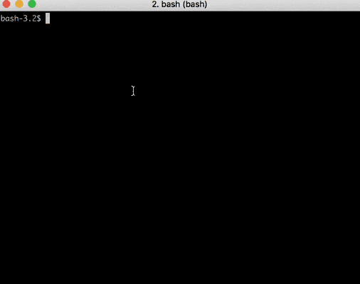

# Introduction

This project can be used to perform database queries on your Neo4j DB. 

Main purpose for this project was to have a fast way to interact with your database, so that you can use it in conjunction with your neo4j browser as a knowledge management tool. 

2 approaches where chosen to fulfill that:

1. Bash files where implemeneted for different CRUD operations you can call with just a few parameters which will translate to cipher queries and connect to database by REST.
2. A python script you can use to produce the same by text menu.

# System Requirements

- gpg >= 2
- python >= 2.7 < 3
- perl 5 >= version 26 
- neo4j >= 3.3

# Before first usage

## Perl
Install necessary perl library:

``` 
cpan Term::ReadKey
```

## Neo4j DB Authorization

To setup authorization for scripts to database
configure credentials with 

```
perl setcreds.pl
```

Only use username and password without special characters

You will be asked for a password which GPG uses to store the credentials:



## Client start

```
python neoc.py
```

## Example

```
python neo4jc.py                                                      [±master ●●]
------------------------------ MENU ------------------------------
1. CREATE
2. CONNECT
3. UPDATE
4. MOVE
5. DELETE
6. READ
7. Exit
-------------------------------------------------------------------
Enter your choice [1-5]: 1
------------------------------ CREATE ------------------------------
Syntax:	 "name" [":label1:label2..."]
Only Enter - back
: "John Smith" ":Person"
{"results":[{"columns":["n"],"data":[{"row":[{"name":"John Smith"}],"meta":[{"id":178,"type":"node","deleted":false}]}]}],"errors":[]}
------------------------------ MENU ------------------------------
1. CREATE
2. CONNECT
3. UPDATE
4. MOVE
5. DELETE
6. READ
7. Exit
-------------------------------------------------------------------
Enter your choice [1-5]: 1
------------------------------ CREATE ------------------------------
Syntax:	 "name" [":label1:label2..."]
Only Enter - back
: "Eve" ":Person"
{"results":[{"columns":["n"],"data":[{"row":[{"name":"Eve"}],"meta":[{"id":133,"type":"node","deleted":false}]}]}],"errors":[]}
------------------------------ MENU ------------------------------
1. CREATE
2. CONNECT
3. UPDATE
4. MOVE
5. DELETE
6. READ
7. Exit
-------------------------------------------------------------------
Enter your choice [1-5]: 2
------------------------------ CONNECT ------------------------------
Syntax for id1 ->	id2 :	 id1 id2
Syntax for id1 -r->	id2 :	 id1 id2 'rel'
Syntax for id1 -r->	id2 :	 id1 id2 'rel' 'specialattr1: bla, specialattr2:blub'
Escape quotes e.g. 'URL:\"https://example.com\"'
Only Enter - back
: 133 178 "KNOWS"
{"results":[{"columns":["n","r","m"],"data":[{"row":[{"name":"Eve"},{},{"name":"John Smith"}],"meta":[{"id":133,"type":"node","deleted":false},{"id":153,"type":"relationship","deleted":false},{"id":178,"type":"node","deleted":false}]}]}],"errors":[]}
------------------------------ MENU ------------------------------
1. CREATE
2. CONNECT
3. UPDATE
4. MOVE
5. DELETE
6. READ
7. Exit
-------------------------------------------------------------------
Enter your choice [1-5]: 5
------------------------------ DELETE ------------------------------
n/N. Node
r/R. Relationship
Only Enter - back
: n
Syntax:	 id
Only Enter - back
: 178
{"results":[{"columns":[],"data":[]}],"errors":[]}
------------------------------ MENU ------------------------------
1. CREATE
2. CONNECT
3. UPDATE
4. MOVE
5. DELETE
6. READ
7. Exit
-------------------------------------------------------------------
Enter your choice [1-5]: 5
------------------------------ DELETE ------------------------------
n/N. Node
r/R. Relationship
Only Enter - back
: n
Syntax:	 id
Only Enter - back
: 133
{"results":[{"columns":[],"data":[]}],"errors":[]}
------------------------------ MENU ------------------------------
1. CREATE
2. CONNECT
3. UPDATE
4. MOVE
5. DELETE
6. READ
7. Exit
-------------------------------------------------------------------
Enter your choice [1-5]: 7
```
